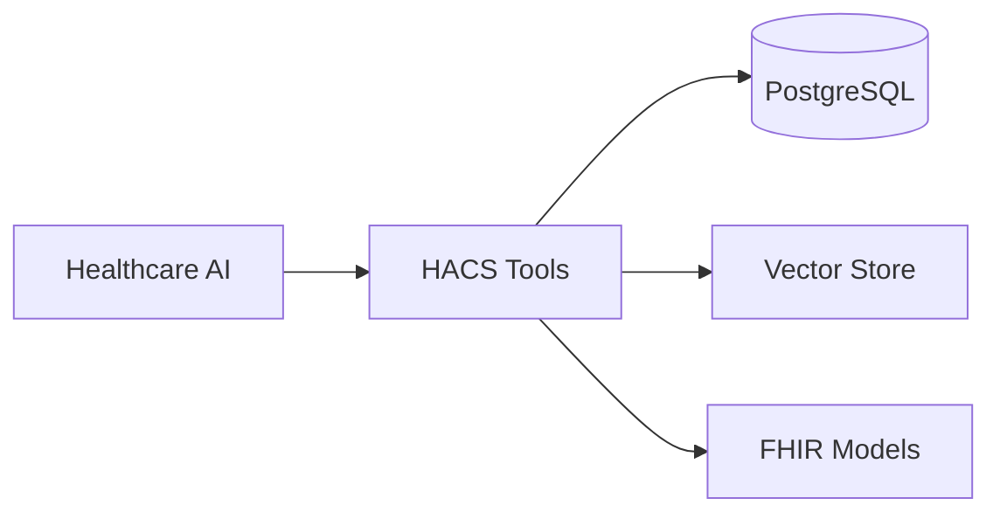

---
search:
  boost: 2
---

# HACS — Context‑engineering framework for healthcare agents

Context‑engineering framework for building healthcare AI with structured memory, clinical reasoning, and FHIR compliance.

## Quick Links

- **[Quick Start](quick-start.md)** - Install HACS and build healthcare AI in 5 minutes
- **[API Reference](api-reference.md)** - Complete API documentation  
- **[HACS Tools](hacs-tools.md)** - 20+ healthcare tools reference
- **[Testing Guide](testing.md)** - Testing and validation
- **Extraction**: `ExtractionRunner`, citation‑guided and one‑step typed extraction

 

## Tutorials

- **[Complete Context Engineering](tutorials/complete_context_engineering.md)** - Full workflow with all 4 strategies
- **[Medication Extraction](tutorials/medication_extraction.md)** - Extract clinical data from text

## Key Features

- **20+ Tools** - Specialized for clinical workflows via MCP protocol
- **FHIR Models** - Type-safe Pydantic models for healthcare data
- **Context Engineering** - Four strategies: Isolate, Select, Compress, Write  
- **Actor Security** - Role-based permissions with audit trails
- **AI Framework Ready** - Works with LangGraph, LangChain, and any MCP client

## Architecture



---

## Install uv CLI

Install the `uv` package manager first. It provides fast, reproducible environments and workspace management.

!!! info "More installation options"

    See the official uv installation guide for standalone installers, Homebrew, pipx, and more: [uv — Installing uv](https://docs.astral.sh/uv/getting-started/installation/).

```bash
# macOS/Linux standalone installer
curl -LsSf https://astral.sh/uv/install.sh | sh

# Verify
uv --version
```

---

## Install HACS (beta)

HACS is in active beta. The preferred install is from source to ensure the latest fixes and docs.

!!! info "Requirements"

    - Python >= 3.11
    - [`uv`](https://docs.astral.sh/uv/getting-started/installation/) (recommended)
    - Optional: PostgreSQL + `pgvector` for persistence (see How‑to)

=== "uv (recommended)"

    ```bash
    # Create virtual environment (requires uv installed)
    uv venv -p 3.11
    source .venv/bin/activate

    # Clone and install workspace from source (editable)
    git clone https://github.com/solanovisitor/hacs-ai.git
    cd hacs-ai
    uv pip install -U pip
    uv sync

    # Configure environment
    cp .env.example .env    # fill OPENAI_API_KEY, DATABASE_URL
    ```

=== "pip"

    ```bash
    python -m venv .venv && source .venv/bin/activate
    pip install -U pip
    pip install -U hacs-core hacs-auth hacs-models hacs-tools hacs-utils hacs-persistence hacs-registry
    ```

!!! info "Missing Local Package?"

    If you are not using `uv` and run into a ModuleNotFoundError for local packages, ensure you installed the workspace or editable packages and re‑activated your environment. Using `uv sync` is recommended.

---

## Next steps

- Follow the [Quick Start](quick-start.md) to validate your setup and run ExtractionRunner or one‑step typed extraction
- Use the CLI: `hacs-tools extract` and `hacs-tools registry --list-extractables`
- Connect to a database: [Connect to database](how-to/connect_postgres.md)
- Generate structured data with LLMs: [Generate structured data](how-to/extract_annotations.md)
- Extract with citations: [Extract citations](how-to/grounded_extraction.md)
- Persist resources: [Persist Resources](how-to/persist_resources.md)

---