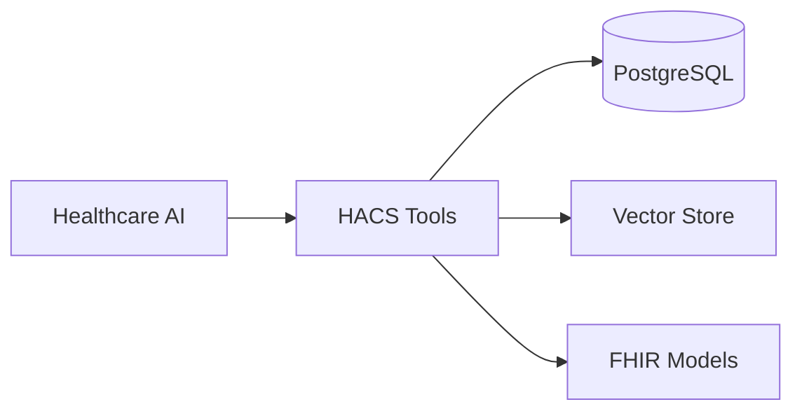

# HACS Documentation

**Healthcare Agent Communication Standard**

Context-engineering framework for building healthcare AI with structured memory, clinical reasoning, and FHIR compliance.

## Quick Links

- **[Quick Start](quick-start.md)** - Install HACS and build healthcare AI in 5 minutes
- **[API Reference](api-reference.md)** - Complete API documentation  
- **[HACS Tools](hacs-tools.md)** - 20+ healthcare tools reference
- **[Testing Guide](testing.md)** - Testing and validation

## Tutorials

- **[Complete Context Engineering](tutorials/complete_context_engineering.md)** - Full workflow with all 4 strategies
- **[Medication Extraction](tutorials/medication_extraction.md)** - Extract clinical data from text

## Key Features

- **20+ Tools** - Specialized for clinical workflows via MCP protocol
- **FHIR Models** - Type-safe Pydantic models for healthcare data
- **Context Engineering** - Four strategies: Isolate, Select, Compress, Write  
- **Actor Security** - Role-based permissions with audit trails
- **AI Framework Ready** - Works with LangGraph, LangChain, and any MCP client

## Architecture

---

**Ready to start?** Begin with the [Quick Start Guide](quick-start.md).